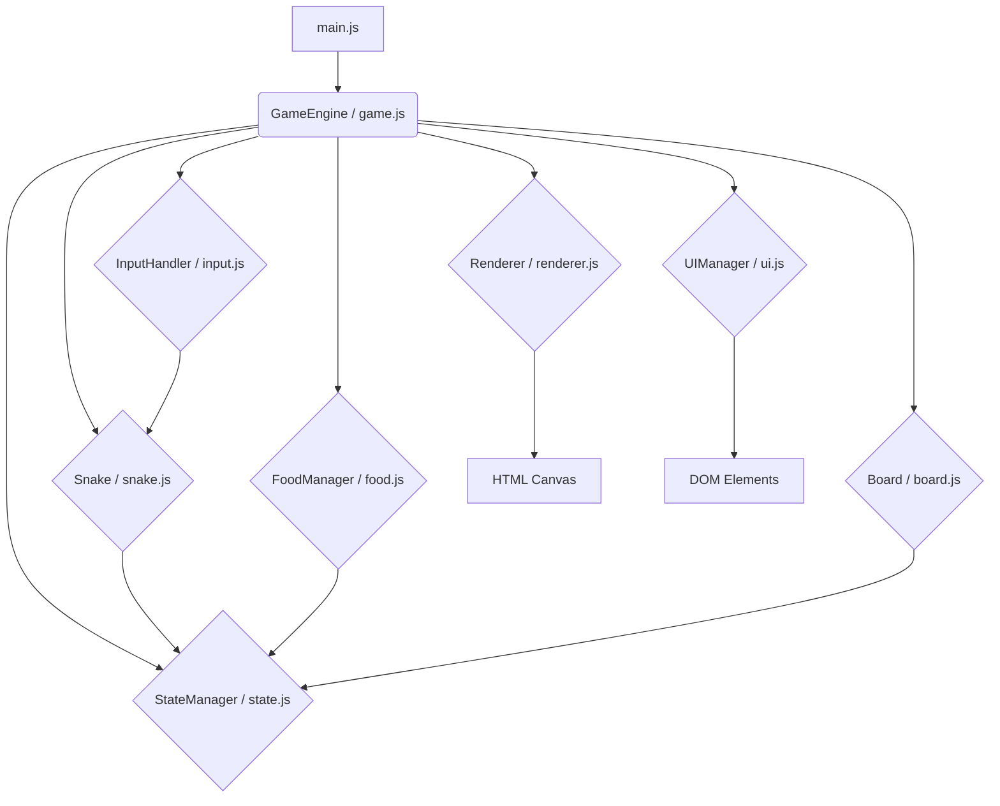

# Architektura Rozbudowanej Gry w Węża

## 1. Wprowadzenie

Niniejszy dokument opisuje proponowaną architekturę dla rozbudowanej gry w węża. Celem jest stworzenie elastycznej i skalowalnej struktury, która umożliwi łatwe dodawanie nowych funkcji w przyszłości.

## 2. Wybór Technologii

**Technologie:** HTML5, CSS3, JavaScript (ES6+)

**Uzasadnienie:**
*   **Dostępność:** Gra będzie działać w każdej nowoczesnej przeglądarce internetowej bez potrzeby instalacji, co zapewnia szeroki zasięg.
*   **Łatwość dystrybucji:** Udostępnienie gry sprowadza się do hostowania plików statycznych lub osadzenia jej na stronie internetowej.
*   **Elastyczność interfejsu:** HTML i CSS dają ogromne możliwości w zakresie tworzenia atrakcyjnego i interaktywnego interfejsu użytkownika (menu, ustawienia, tablice wyników).
*   **Rozszerzalność:** JavaScript, wraz z bogatym ekosystemem bibliotek, ułatwia implementację zaawansowanych funkcji, w tym potencjalnych funkcji sieciowych (np. tablice wyników online, tryb multiplayer w przyszłości przy użyciu WebSocketów).
*   **Społeczność i zasoby:** Duża społeczność deweloperów i mnóstwo dostępnych materiałów edukacyjnych.

## 3. Struktura Projektu

Proponowana struktura katalogów i plików:

```
snake-game/
├── index.html         # Główny plik HTML (kontener dla gry)
├── css/
│   └── style.css      # Style CSS dla layoutu, gry i interfejsu
├── js/
│   ├── main.js        # Punkt wejściowy aplikacji, inicjalizacja gry
│   ├── game.js        # Główny silnik gry (pętla gry, zarządzanie)
│   ├── snake.js       # Logika i stan węża
│   ├── food.js        # Logika i stan jedzenia
│   ├── board.js       # Logika i stan planszy (rozmiar, przeszkody)
│   ├── input.js       # Obsługa wejścia użytkownika (klawiatura)
│   ├── ui.js          # Zarządzanie interfejsem użytkownika (wynik, menu, komunikaty)
│   ├── state.js       # Zarządzanie stanem gry (PLAYING, PAUSED, GAME_OVER)
│   ├── renderer.js    # Odpowiedzialny za rysowanie na <canvas>
│   └── constants.js   # Stałe konfiguracyjne gry
├── assets/            # Zasoby graficzne i dźwiękowe (opcjonalnie)
│   ├── images/        # Obrazki (np. tła, sprite'y)
│   └── sounds/        # Dźwięki (np. jedzenie, kolizja, muzyka)
├── README.md          # Ogólny opis projektu
└── ARCHITECTURE.md    # Ten dokument
```

## 4. Główne Komponenty (Moduły/Klasy)



*   **`main.js`:** Inicjalizuje główne obiekty gry (silnik, renderer, obsługę wejścia) i uruchamia pętlę gry.
*   **`GameEngine (game.js)`:**
    *   Zarządza główną pętlą gry (`requestAnimationFrame`).
    *   Koordynuje aktualizacje stanu (`update()`) i rysowanie (`render()`) w każdej klatce.
    *   Komunikuje się z innymi komponentami.
    *   Wywołuje logikę zależną od aktualnego stanu gry (pobranego z `StateManager`).
*   **`Snake (snake.js)`:**
    *   Przechowuje stan węża (pozycja segmentów, kierunek ruchu).
    *   Implementuje logikę ruchu, wzrostu po zjedzeniu jedzenia.
    *   Odpowiada za detekcję kolizji (z samym sobą, granicami planszy, przeszkodami).
*   **`FoodManager (food.js)`:**
    *   Przechowuje pozycję i typ aktualnego jedzenia.
    *   Implementuje logikę generowania nowego jedzenia w losowym, dozwolonym miejscu.
    *   Obsługuje różne typy jedzenia/bonusów.
*   **`Board (board.js)`:**
    *   Definiuje wymiary planszy (siatkę gry).
    *   Przechowuje informacje o przeszkodach (jeśli istnieją).
    *   Może zawierać metody pomocnicze (np. sprawdzanie czy dana pozycja jest w granicach planszy).
*   **`InputHandler (input.js)`:**
    *   Nasłuchuje na zdarzenia klawiatury (`keydown`).
    *   Mapuje wciśnięte klawisze na akcje w grze (zmiana kierunku węża).
    *   Zapobiega ruchowi węża w przeciwnym kierunku.
*   **`UIManager (ui.js)`:**
    *   Odpowiada za aktualizację elementów interfejsu użytkownika w DOM (wynik, poziom, komunikaty o stanie gry).
    *   Obsługuje interakcje z menu (np. przyciski Start, Pauza, Restart).
*   **`StateManager (state.js)`:**
    *   Przechowuje aktualny stan gry (np. `MENU`, `PLAYING`, `PAUSED`, `GAME_OVER`).
    *   Dostarcza metody do zmiany stanu gry.
*   **`Renderer (renderer.js)`:**
    *   Odpowiada za rysowanie wszystkich elementów gry (plansza, wąż, jedzenie, przeszkody) na elemencie `<canvas>`.
    *   Pobiera informacje o stanie elementów od odpowiednich komponentów.
*   **`constants.js`:** Przechowuje stałe wartości konfiguracyjne (np. `GRID_SIZE`, `CELL_SIZE`, `INITIAL_SPEED`, `SPEED_INCREMENT`) w jednym miejscu, ułatwiając modyfikację parametrów gry.

## 5. Proponowane Rozbudowane Funkcje

Lista potencjalnych funkcji wykraczających poza standardową grę w węża:

*   **Poziomy trudności:** Regulowana prędkość, liczba przeszkód.
*   **Przeszkody:** Statyczne lub ruchome bloki na planszy.
*   **Bonusy/Power-upy:**
    *   Różne rodzaje jedzenia (więcej/mniej punktów).
    *   Tymczasowe przyspieszenie/spowolnienie.
    *   Skrócenie węża.
    *   Tymczasowa nietykalność (przechodzenie przez ściany/ogon).
    *   "Pułapki" (negatywne efekty).
*   **Tablica wyników:** Lokalna (localStorage) i/lub online (wymaga backendu).
*   **Tryb dla dwóch graczy:** Lokalny (wspólna klawiatura) lub sieciowy (WebSocket).
*   **Personalizacja:** Wybór wyglądu węża, planszy, motywów.
*   **Tryb Kampanii/Poziomów:** Zdefiniowane cele do osiągnięcia na kolejnych planszach.
*   **Dźwięki i Muzyka:** Efekty dźwiękowe i muzyka w tle.
*   **Osiągnięcia/Wyzwania:** Dodatkowe cele motywujące gracza.
*   **Różne Tryby Gry:** Np. Zen, Przetrwanie, Czasowy.
*   **Wsparcie dla urządzeń mobilnych:** Obsługa dotyku.

## 6. Następne Kroki

Po akceptacji tej architektury, następnym krokiem będzie rozpoczęcie implementacji poszczególnych komponentów zgodnie z zaprojektowaną strukturą, zaczynając od podstawowej mechaniki gry.